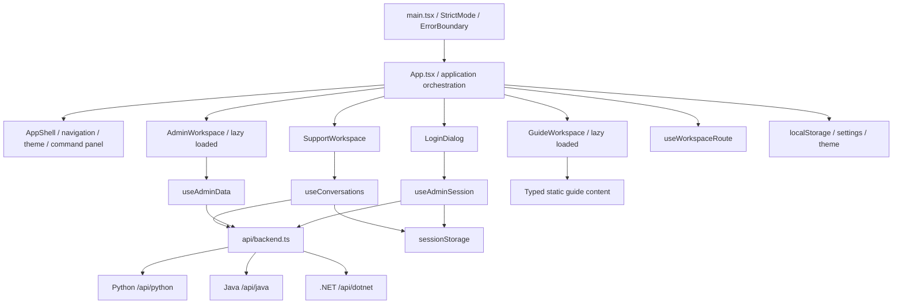
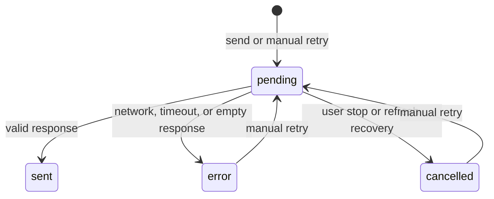

# Support Workspace: Architecture, Detailed Design, and Trade-offs

Version: 2026-10-06
Scope: `CompanyAgentFrontend`

This document describes the implemented frontend architecture, interaction model, security boundaries, and major design decisions for the React and TypeScript migration.

## 1. Goals and boundaries

The original frontend concentrated chat, persistence, Markdown rendering, authentication, backend selection, operational metrics, and knowledge management in a single Vue component. The refactor separates those responsibilities into a React application with strict TypeScript boundaries while preserving API compatibility with the Python, Java, and .NET services.

The product now provides three focused workspaces:

- Support conversations for customer-facing assistance.
- Guides for searchable, structured product documentation.
- Operations for authenticated service health and knowledge management.

The redesign also adds theme switching, keyboard navigation, conversation history search, deletion confirmation, response copy actions, request cancellation and retry, guide search, partial-failure handling in operations, validated file upload, URL-addressable workspaces, and browser back/forward support.

Deployment remains intentionally simple: Vite produces static assets, Nginx serves them, and the existing Caddy/API proxy routes backend traffic.

The following are explicitly outside this iteration:

- Server-side rendering.
- Backend rewrites.
- Token streaming.
- Server-side conversation deletion.
- Token revocation.
- Live human-agent handoff.
- Historical time-series metrics.
- Server-enforced idempotency for write requests.

The interface does not present simulated capabilities or fabricated operational data for APIs that do not exist.

## 2. System architecture

### 2.1 Layer responsibilities

| Layer or file | Responsibility | Explicit boundary |
| --- | --- | --- |
| `App.tsx` | Theme, settings, active conversation, authentication, and workspace composition | Does not parse transport fields |
| `components/layout` | Navigation, history, mobile drawer, and command panel | Does not send business requests |
| `components/support` | Topic cards, messages, composer, Markdown, and copy actions | Does not access browser storage directly |
| `components/guides` | Guide navigation, search, table of contents, and empty states | Does not introduce a remote CMS dependency |
| `components/admin` | Login, metrics, knowledge tools, settings, and diagnostics | Does not call `fetch` directly |
| `components/ui` | Brand, dialog, and error boundary primitives | Does not depend on business state |
| `hooks` | State ownership, asynchronous lifecycles, cancellation, and race protection | Does not define page layout |
| `api/backend.ts` | URL handling, HTTP status preservation, timeouts, and field normalization | Does not control navigation or notifications |
| `lib` | Storage resilience, record validation, and pure conversation utilities | Does not depend on the React DOM |
| `types.ts` | Domain models and shared component contracts | Does not hide protocol differences behind `any` |

### 2.2 Core domain models

- `BackendSettings`: selected backend, customer identifier, and the three service endpoints.
- `RequestContext`: immutable snapshot of backend ID, resolved URL, and customer identifier for a request.
- `Conversation`: local UUID, title, update time, optional server ID, request context, and messages.
- `Message`: user or assistant role, content, lifecycle state, and optional response metadata.
- `AdminSession`: access token, username, and the exact service URL that issued the session.
- `Dashboard`: health, knowledge count, alerts, monitor output, per-endpoint errors, and check time.

HTTP and storage values enter the application as `unknown`. Runtime object and field checks project them into domain models. Monitor payloads deliberately remain `Record<string, unknown>` because each backend may expose different diagnostic fields.

## 3. State architecture

| State | Owner | Lifecycle and rationale |
| --- | --- | --- |
| Workspace and guide ID | URL query via `useWorkspaceRoute` | Survives refresh and supports sharing, back, and forward |
| Conversations, active item, request controllers | `useConversations`, mounted by `App` | Workspace navigation does not interrupt active requests |
| Draft text | Support workspace, keyed by conversation ID | Isolated across conversations; not guaranteed after leaving the workspace |
| Operations data | `useAdminData` | Scoped to URL and token; stale service data is cleared on scope changes |
| Login password | Local `LoginDialog` state | Never persisted and released when the dialog closes |
| Access token | Memory and `sessionStorage` | Restored on refresh without entering long-lived settings |
| Theme, endpoints, customer ID | `localStorage` | User preferences survive browser sessions |

### 3.1 Conversation state machine

Every request captures both its request context and target conversation UUID. A response can update only that original UUID. Duplicate concurrent requests are blocked within one conversation, while separate conversations may run independently.

Deleting a conversation aborts its active request before removing local state, so a late response cannot recreate the conversation. Retry reuses the failed user message identifier and does not duplicate the same visible prompt.

Cancellation stops the browser from waiting; it cannot guarantee that backend inference stops. Because the services do not currently support idempotency keys, a manual retry may be processed again by the server. The client never automatically retries writes.

An existing conversation remains attached to the backend, endpoint, and customer ID captured when it was created. Settings changes apply only to new conversations. Legacy records without a request context are bound to the selected backend during migration because their original source cannot be reconstructed reliably.

Pending records restored after a page refresh become `cancelled`, preventing an indefinite loading state. Normal history is capped at 30 entries; active conversations are not evicted, so unusually high concurrency may temporarily exceed the cap. If persistence fails, the application continues in memory and surfaces a warning.

### 3.2 Operations request consistency

Health, knowledge statistics, monitoring, and overview requests load concurrently through `Promise.allSettled`. Each result preserves its own success or failure state. Missing data is displayed as an em dash rather than being misrepresented as zero alerts, zero documents, or healthy status.

Refresh, search, and mutation flows use separate `AbortController` instances. A newer operation cancels an older operation of the same kind. Changing the URL or token, or unmounting the workspace, cancels all active requests. Before applying a response, the hook verifies its original scope so stale data from one backend cannot overwrite another backend's view.

Backend switching and connection-setting changes are disabled during knowledge mutations. Mutation outcomes and monitoring outcomes are stored independently, so a later dashboard refresh does not erase a successful upload result.

## 4. API and authentication design

| Operation | Method and path | Contract |
| --- | --- | --- |
| Chat | `POST /chat` | `message`, `user_id`; Python uses `conv_id`, Java/.NET use `conversation_id` |
| Health | `GET /health` | No token; reads `status` |
| Login | `POST /admin/login` | `username` and `password` to `access_token` and `username` |
| Overview | `GET /admin/overview` | Bearer token; reads `alerts` and fallback `knowledge_chunks` |
| Knowledge statistics | `GET /knowledge/stats` | Accepts `total_chunks` or `totalChunks` |
| Monitoring | `GET /monitor` | Preserves the diagnostic JSON payload |
| Search | `POST /search?query=...&top_k=5` | Encodes parameters with `URLSearchParams`; maps ID, title, content, and score |
| Add knowledge | `POST /knowledge/add` | Sends a `documents` array containing title and content |
| Upload | `POST /knowledge/upload` | Sends a `FormData` file; the browser owns the multipart boundary |

Chat response normalization accepts differences such as `conversation_id`, `conversationId`, `conv_id`, `agent_type`, `agentType`, `latency_ms`, and `latencyMs`.

Standard requests time out after 30 seconds. Chat and upload requests allow 120 seconds. The API layer combines a caller-provided signal with the timeout signal and always releases timers in `finally`. The existing Nginx 60-second read timeout may still terminate a request earlier; deployment timeout changes are outside this frontend iteration.

`ApiError` preserves the HTTP status. A `401` expires the session for the current service, a `403` is shown as an authorization failure, and empty or unparseable responses are failures. Customer-facing surfaces receive actionable, non-sensitive messages; operational diagnostics remain available to administrators.

Authentication storage is keyed by `backendId:normalizedBaseUrl`. Changing an endpoint therefore cannot send an old token to a different service. A legacy backend-only token is migrated once to its configured URL. Logout clears all locally stored administrator sessions. Because no revoke endpoint exists, client logout does not revoke the token on the server.

Login credentials are sent only to the selected service, replacing the previous behavior of sending the password to all three services. This isolates credentials and backend failures, at the cost of requiring another login when switching services. Server-side authorization remains the real security boundary; hiding controls in the frontend is not authorization.

## 5. Visual system and component design

The visual direction is a calm, precise support workspace: forest-green navigation, warm-white surfaces, sage accents, restrained semantic colors, and a complete dark theme. This is better suited to prolonged support reading and writing than the earlier blue-black glass treatment.

| Element | Design and implementation | Purpose |
| --- | --- | --- |
| Sidebar | Brand, primary action, navigation, history, utilities, and account | Creates stable information hierarchy |
| Hero heading | Manrope, compact tracking, and two-tone lines | Establishes a clear visual anchor |
| Body typography | DM Sans with system fallbacks | Supports both forms and long-form reading |
| Orbital mark | CSS gradients, elliptical tracks, and subtle motion | Communicates understanding and connection without a large bitmap |
| Topic cards | Four semantic accents, sequence numbers, icons, and hover elevation | Inserts an editable starter question |
| Assistant response | Role marker, safe Markdown, copy action, and knowledge marker | Improves scanning and follow-up actions |
| Resource rail | Process explanation and guide entry points | Progressively discloses product capabilities |
| Metric cards | Label, value, and explanation without fabricated trends | Shows only data supplied by the APIs |
| Empty states | Illustration, explanation, and a concrete next action | Explains why no data is visible |
| Feedback | Independent loading, error, and success states | Prevents one global busy state from blocking the product |
| Source link | Recognizable GitHub mark, persistent “GitHub” label, and button treatment | Makes the repository destination understandable without icon recognition |

Theme tokens live in `theme.css`; `workspaces.css` owns guide and operations layouts. Controls use consistent primary, secondary, and destructive treatments. Fields, errors, empty states, and dialogs follow the same visual grammar. Lucide icons provide consistent stroke weight and sizing. Motion runs only when `prefers-reduced-motion` permits it.

### 5.1 Responsive behavior

Wide screens show the sidebar, main conversation, and resource rail. Below 1050px, the resource rail is removed. Below 760px, the sidebar becomes a drawer. Below 460px, decorative and secondary content is reduced while essential labels remain visible.

Operations metrics change from four columns to two, and knowledge panels change from two columns to one. Tables, code, and JSON diagnostics scroll horizontally within their own bounds instead of expanding the page.

Long conversations scroll inside the main region. Automatic following pauses while the user reads earlier content, and a return-to-bottom control becomes available. Enter sends, Shift+Enter inserts a line break, and input method composition never triggers submission. Message input is limited to 10,000 characters.

### 5.2 Accessibility

The application provides a skip link, visible focus indicators, explicit labels, accessible names for icon buttons, live status messages, error announcements, native dialogs, and Escape handling. When the mobile drawer is hidden, it does not leave focusable controls off screen.

Ctrl/Cmd+K opens searchable navigation, and Tab selects actions predictably. Guides provide chapter search, anchors, empty-result recovery, and reading-time estimates.

Theme selection is preserved. Automated axe checks cover critical screens, but they are not a substitute for full manual WCAG certification with real assistive technology and target devices.

## 6. Security, storage, and content handling

Markdown is rendered with `react-markdown` and `remark-gfm`. Raw HTML is disabled, URL transformation remains restricted, external links use `noopener` and `noreferrer`, and model-provided images render as alternative text rather than initiating remote image requests. Diagnostic JSON is rendered as text.

Endpoints may be HTTP(S) URLs or same-origin absolute paths. Protocol-relative URLs, embedded credentials, query strings, and fragments are rejected. Knowledge uploads accept only non-empty TXT, MD, or JSON files up to 5 MB. The backend must independently validate every upload; client validation is a usability layer, not a security boundary.

Tokens remain readable by same-origin JavaScript, so `sessionStorage` does not defend against same-origin XSS. A stricter future session model should combine backend support for HttpOnly cookies with an appropriate CSRF strategy.

Fonts currently load from Google Fonts and fall back to system fonts. Offline or privacy-sensitive deployments can self-host the font assets without changing the component architecture.

## 7. Architecture decision records

| Decision | Rationale | Cost and alternatives | Revisit when |
| --- | --- | --- | --- |
| React SPA with Vite | Reuses static deployment and the existing reverse proxy | No SSR; a framework such as Next.js is an alternative | SEO or server rendering becomes necessary |
| Native React hooks | The three workspace state boundaries are currently explicit and manageable | Request consistency is maintained in-house | Server cache complexity or realtime collaboration grows |
| Query-based routing | Lightweight, shareable, and compatible with browser history | No nested routes or route loaders | Dynamic entity routes become common |
| CSS design tokens | Precise theme and visual control without framework styling constraints | Requires disciplined class and stylesheet ownership | Multiple products need a shared design system package |
| No charting library | Current APIs do not expose stable time-series data | No historical trend visualization | Backends provide trustworthy time-series data |
| Structured Markdown renderer | Semantic output, safe defaults, and GFM support | Adds parsing weight to the client bundle | First-load budgets tighten or the server provides a safe AST |
| Lazy-loaded guides and operations | Customer chat does not pay for all workspace logic | First entry has a short loading boundary | Measured first-open latency requires prefetching |
| Native dialog | Built-in modal, Escape, and focus behavior | Depends on modern browser support | Legacy WebView support is required |
| Single-service login | Clear credential scope and token ownership | Switching services may require another login | A unified identity provider is introduced |
| Request cancellation | Fits the existing HTTP protocol and prevents stale UI updates | Does not cancel backend inference | A task-cancellation or idempotency protocol becomes available |
| Bounded local history | Controls browser storage and navigation size | No durable cross-device history | A server conversation API is introduced |

## 8. Engineering implementation

The application uses React 19, strict TypeScript 5, Vite 7, Lucide, `react-markdown`, and `remark-gfm`, with exact dependency resolution captured by the package lock.

Testing uses Vitest, Testing Library, jsdom, Playwright, and axe. Production builds run `tsc --noEmit` before Vite. The migrated application contains no business JavaScript files, Vue single-file components, `any` escape hatches, or `ts-ignore` directives.

Vite, test tooling, and formatting tooling are development dependencies; runtime libraries remain production dependencies. Prettier provides consistent formatting. `ErrorBoundary` handles render failures and offers reload recovery, while domain hooks handle HTTP failures at the appropriate workspace boundary.

## 9. Delivery and rollback

Feature ownership is separated by file boundary. Build configuration, dependencies, and application entry-point changes are kept together as one integration unit. Feature modules may exist without being referenced by the legacy entry point until the runtime switch is applied.

The complete React application must be validated after integration. A successful legacy Vue build on an isolated feature branch does not prove that the React composition is valid.

Rollback is performed by reverting the integrated frontend changes, restoring the previous entry point and dependency set, and reinstalling dependencies. Existing settings and conversation storage keys remain compatible. The new administrator-session structure is not guaranteed to be readable by the old frontend, so users may need to authenticate again after rollback. Backend source and production infrastructure are not modified by this frontend migration.

## 10. Sources of truth

- [React TypeScript documentation](https://react.dev/learn/typescript) for TSX, component, and hook typing patterns.
- [Vite documentation](https://vite.dev/guide/) for the SPA build and runtime baseline.
- [react-markdown project documentation](https://github.com/remarkjs/react-markdown) for Markdown rendering and plugin boundaries.
- The repository's Python API, Java controllers, and .NET DTOs for transport contracts and field compatibility.
